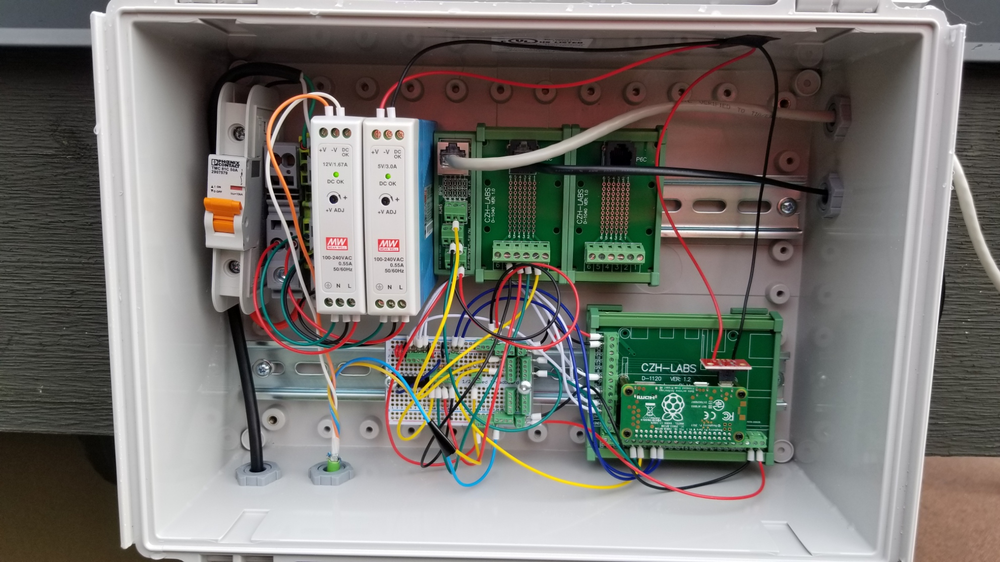

# Project Background
---

I have always wanted to do an fully fledged IoT project with Raspberry Pis, but never found the time between co-op or school. While a weather station project is a classic and popular computer science undergraduate project, you would be suprised at how much weather data and prediction is relied upon.

---
## Objectives

I wanted to create a weather station within the following scope:

- On 24/7
- Stream meteorological data every 1-5 minutes
- Store meteorological data somewhere cheap
- Have the electronics shieleded from the elements and be water resistant

I wanted to collect the followint meteorological data:

1. Temperature
2. Humidity
3. Pressure
4. Precipitation
5. Wind Direction
6. Wind Speed
7. Air quality using the PM2.5 measurements

In a previous iteration I wanted to collect UV light intensity, but this idea was shelved as I was unable to come up with a suitable outdoor housing solution.

---
## Tasks
### Prototyping

Luckily I had some electronic prototyping equipment lying around including a breadboard, a couple Raspberry Pis, jumper wires, LEDs, resistors, etc. This allowed me to prototype fairly cheaply as I only had to purchase the sensors.

I first spent time trying to collect data from each sensor individually. Then once I had all the sensor working independently I tried to simulate the weather station by having them all streaming at the same time indoors in a controlled environment.

### Sourcing Parts

Sourcing parts was fairly complex, as you have to keep in mind several factors in order to meet the outlined objectives

- What is an appropriate housing for the electronics to withstand water/rain and other weather elements?
- How will all the electronics be housed and/or mounted
- Can all the sensors run off the power of the Raspberry Pi or do they need separate power supplies?
- What guage wire is appropriate?
- What tool will I need to connect the board to the sensors?

Sourcing the housing for the electronics was the most difficult task, as I had to ensure that all the componenets would fit, and that there was enough spare room for wiring. I opted for a weatherproof housing with internal din rail mounts for the electronics.

Sourcing electronics was straightforward enough. Ensuring the power ratings for the power supplies don't fry you components was the only task that needed careful attention. I sourced most of the tool and components from Amazon, DigiKey, and Adafruit.

I sourced mounting hardware from Homedepot, which allowed me to attach the whole weather station to the side of the roof.

### Assembly

As long as you plan ahead correctly, there should be no great suprises when you try an assemble the weather station. The only challenge I had was drilling cable gland holes in the housing.

## Results

The weather station currently works which required only a 2 days of troubleshooting to get the rainguage to work. Despite double checking the wiring, I had wired it to ground instead of 3.3V.