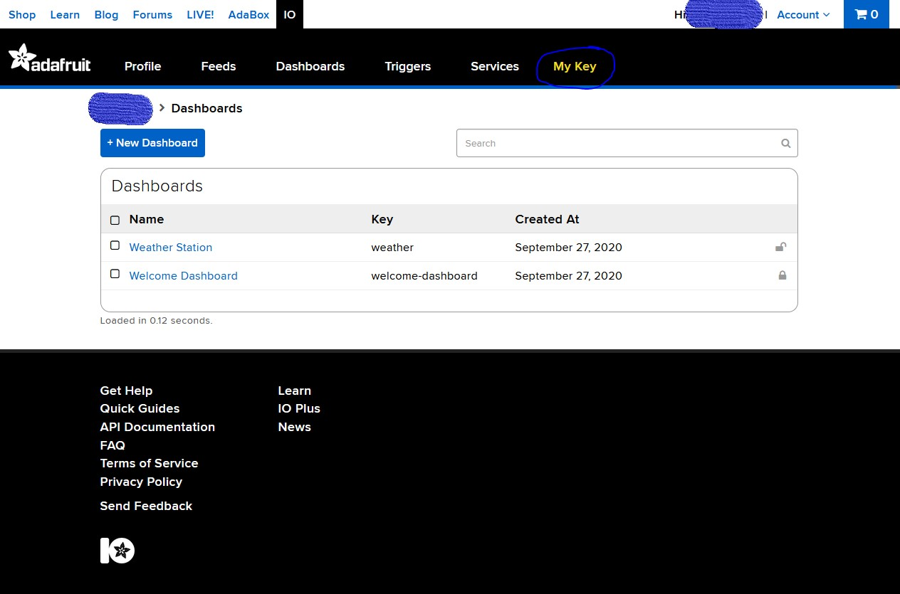

# Setup and Install
---
## Setup Adafruit IO and your `.env` file
1. Create an [Adafruit](https://www.adafruit.com/) account
2. Login and Navigate to [Adafruit IO](https://io.adafruit.com/)
3. Using a text editior of your choice, create a file called `.env` and add the following information:
```
ADAFRUIT_IO_USERNAME = <"your_adafruit_io_username">
ADAFRUIT_IO_KEY = <"your_adafruit_io_key">

LOCATION_LATITUDE = <latitude_of weather station>
LOCATION_LONGITUDE = <longitude_of_weather_station>
LOCATION_ELEVATION = <elevation_of_weather_station>
```
Your username and key can be found under the `My Key` tab (hilighted in yellow)</br>

</br>
4. Save your `.env` file for later

---
## Headless Setup for the Raspberry Pi:
You can either watch [this video](https://www.youtube.com/watch?v=dhY8m_Eg5iU) or use my method:

1. Insert your microSD card into your computer, and format it as FAT32 using [Windows](https://www.diskinternals.com/partition-recovery/format-sd-card-fat32-windows-10/), [macOS](https://www.easeus.com/mac-file-recovery/format-usb-flash-drive-to-fat32-on-mac.html), or [Linux](https://linuxhint.com/format_usb_drive_linux/). I would suggest using the disk utility method for both macOS and Linux if those options are available.
2. Download, install, and run [Raspberry Pi Imager](https://www.raspberrypi.org/downloads/) 
3. Under `Operating System` Choose `Raspberry Pi OS (Other)` --> `Raspberry Pi OS (Lite)`
4. Under `SD Card` choose the SD card that your formatted earlier in step `1`
5. Hit the `Write` Button and follow the onscreen instructions </br>
### The following instructions are to be used if you plan on setting up you Raspberry Pi completely headless. Otherwise the following steps can be setup using `raspi-config`
6. Once the Card has finished writing the OS image, remove and re-insert your SD card back into your computer
7. You need to add to files to the `boot` partition:</br></br>
    a. And empty file called `ssh` (no extension). This will allow remote ssh into the raspberry pi for configuration. See step [3. Enable SSH on a headless Raspberry Pi (add file to SD card on another machine)](https://www.raspberrypi.org/documentation/remote-access/ssh/)</br></br>
    b. If you plan on connection your Raspberry Pi through an RJ45 Ethernet cable you can skip this step. If the RaspberryPi will be connected using WIFI, modify `wpa-supplicant` file by adding your [WIFI SSID and passowrd by "Adding the network details to the Raspberry Pi"](https://www.raspberrypi.org/documentation/configuration/wireless/wireless-cli.md)</br></br>
8. Eject the SD card from your computer. Insert it into the Raspberry Pi and power it on.

---
## Raspberry Pi Configuration (via SSH)
Assuming you have setup the Raspberry Pi Correctly you should be able to connect to it via SSH:
```bash
$ ssh pi@raspberrypi.local
```
If this does not work, you will need to find out the IP address of the Raspbery Pi via your router. Finding this information depends on you router but should available when logged into your router. For ease of use you may want to [set a static IP address](https://pimylifeup.com/raspberry-pi-static-ip-address/) for your Raspberry Pi but this is not required.
```bash
$ ssh pi@XXX.XXX.XX.XXX
```
Defaults:
- username: `pi`
- password: `raspberry`

Once connected to an SSH terminal instance on the Raspberry Pi:


1. Install git
```bash
$ sudo apt install git -y
```
2. Configure Raspberry Pi

```bash
$ sudo raspi-config
```
Use `arrow keys` and `tab` to highlight, the `return key` to select</br>
REQURIED
- Update `raspi-config`: `Update`
- Set network at boot: `System Options` -> `Network at Boot` -> `Yes`
- Enable I2C: `Interface Options` -> `I2C` -> `Yes`
- Enable SPI: `Interface Options` -> `SPI` -> `Yes`
- Set Timezone: `Localization Options` -> `Timezone` -> [Select your timezone](https://www.timeanddate.com/time/map/)
- Set WLAN Country: `Localization Options` -> `WLAN Country` -> [Select your WLAN Country Code](https://www.arubanetworks.com/techdocs/InstantWenger_Mobile/Advanced/Content/Instant%20User%20Guide%20-%20volumes/Country_Codes_List.htm)


OPTIONAL:
- Minimize GPU Memory (If you plan on only using the terminal interface and not the GUI): `Performance Options` -> `GPU Memory` -> Set it to `16`
- Change Passowrd (Highly recommended) -> `System Options` -> `Password` -> Follow instructions

3. Clone the repository
```bash
$ git clone https://github.com/travswim/RPIWeatherStation.git
$ cd RPIWeatherStation/
```
4. Place your `.env` file that you saved earlier in RPIWeatherStation/weather/
5. Enable and run the install script
This will update and upgrade Raspbian OS, install Python the dependencies, and add the app as a service to `systemd` to allow it to start on reboot. The Raspberry Pi should then restart
```bash
$ chmod +x install.sh
$ ./install
```
If you made your `.env` file correctly, you should see new feeds created in Adafruit IO:
- temperature
- humidity
- rainfall
- pressure
- pm10
- pm25
- pm100
- winddirection
- windspeed
---
## Creating a Dashboard on Adafruit IO

Once your weather station is streaming data to the feeds, you can create a dashboard on Adafruit IO using [this guide](https://learn.adafruit.com/adafruit-io-basics-dashboards) to display sensor data.