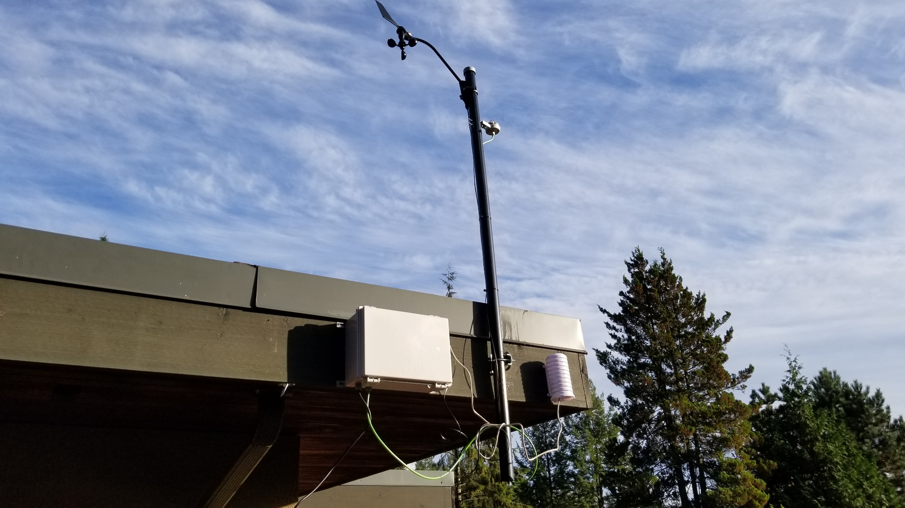

# Raspberry Pi Weather Station
---
The [Raspberry Pi](https://www.raspberrypi.org/) weather station is an IoT project used to demonstrate the use of [Python](https://www.python.org/), Linux, [Adafruit IO](https://io.adafruit.com/), various meteorological sensors, and a Raspberry Pi to stream meteorological data. It uses Raspberry Pi OS (lite) and python to collect meteorological data and send it to Adafruit IO. This guide provides the code installation and setup.

---
## Background & Objectives
You can read about why I made this project [here](BACKGROUND.md)

---
## Contributing
See [here](CONTRIBUTING.md)

---
## Bill of Materials and Tools
This [Google Sheet](https://docs.google.com/spreadsheets/d/1kITqek3yLI9NMS-gQCwhuHgNykaOrIz1MKBfJmgWq-s/edit?usp=sharing) contains all the materials, tools, and hardware used to assemble the weather station. Some hardware/sensor improvements are provided here:
</br></br>
### UPDATE - Hydreon RG-15
When I first set out do buy a digital rain guage to replace a tipping bucket, the best option that stood out was the [Hydreon RG-11](https://rainsensors.com/products/rg-11/). Since completing this project, Hydreon has come out with a better version of their digital rain gauge called the [RG-15](https://rainsensors.com/products/rg-15/). Although being more expensive than the RG-11, it is specifically designed to be a digital solution to replace the tipping-bucket, and is more accurate (± 10%) than the RF-11 (± 36% 2/3 of the time).

---
## Wiring
- Wiring tips, connecting individual sensors, and circuit diagrams can be shown [here](WIRING.md)
- The power distribution diagram can be found in [images/weather-Pi-PowerDist.pdf](images/weather-Pi-PowerDist.pdf)

---
## Setup and Install
NOTE: This assumes you have correctly wired your Raspberry Pi to the sensors.

See the [Install page](INSTALL.md)


---
# Troubleshooting
## SPI and I2C Not Working
Sometimes after an update the I2C and SPI interfaces will stop working. This can be solved by re-enabling them in `raspi-config`:
```bash
$ sudo raspi-config
```
Follow the previous setup and install instructions to enable SPI and I2C again

---
## Application Crash
There is curretly a known bug that will crash the application when sending the `wind direction` to the Adafruit IO feed. While I attempt to solve the bug and apply a fix, rebooting the Raspberry Pi solves this issue:
```bash
$ sudo reboot
```

---
## Updates
