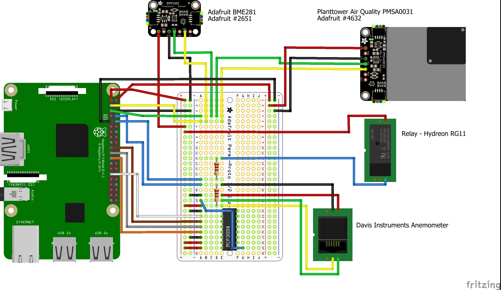
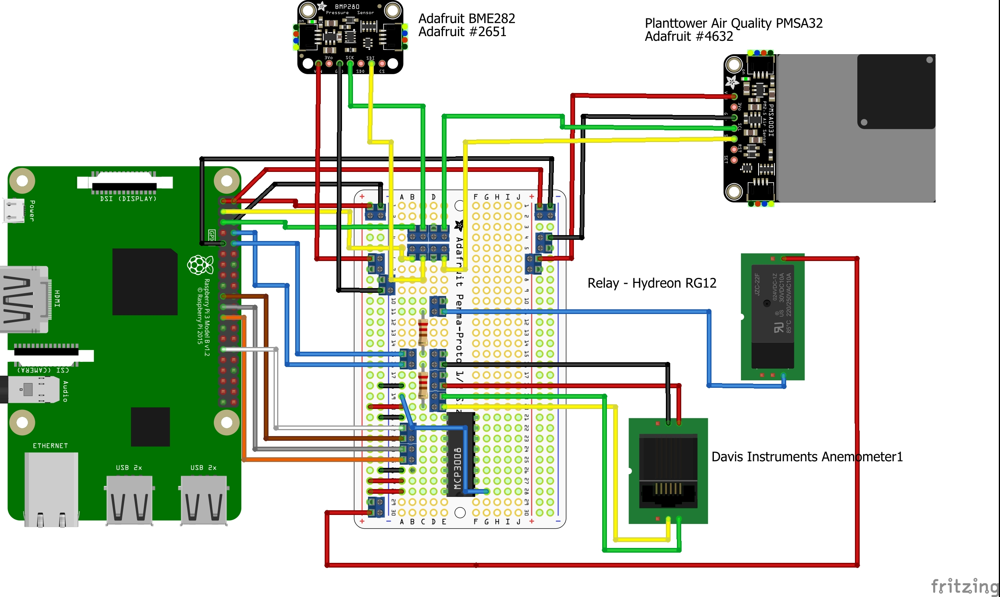

# Wiring

## Fritzing Diagrams

Both diagrams are the same. The first without terminal blocks and the second one with terminal blocks on the perf board.
  

Figure 1: Fritzing Diagram without Terminal Blocks

  

Figure 2: Fritzing Diagram with Terminal Blocks

## Wiring Tips

I suggest adding terminal blocks to the perf board and adding ferrules to your wire ends to allow easier changes if you make a mistake. See the BOM for the tools I used for crimping ferrules and soldering.

## Individual Sensor Connection
Take a look at these resources for hooking up and testing the sensors to the Raspberry Pi
- [BME280](https://learn.adafruit.com/adafruit-bme280-humidity-barometric-pressure-temperature-sensor-breakout/python-circuitpython-test)
- [PM2.5](https://learn.adafruit.com/pm25-air-quality-sensor/python-and-circuitpython)
- [Hydreon RG-11 (Adapted)](http://cactus.io/hookups/weather/rain/hydreon/hookup-arduino-to-hydreon-rg-11-rain-sensor)
- [Davis Anemometer](http://cactus.io/hookups/weather/anemometer/davis/hookup-arduino-to-davis-anemometer)

For the Hydreon RG-11 and the Davis Anemometer, you don't need the pull-up/down resistors as shown in the examples. The Raspberry Pi has internal pull-up/down resistors unlike the Arduino.

